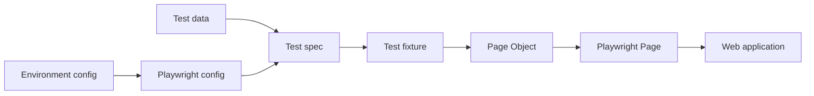
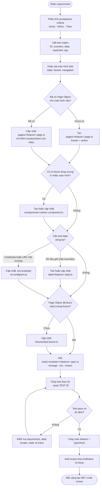

# Playwright Web Automation Architecture & Intern Handover Guide

Tài liệu này mô tả kiến trúc automation test hiện tại của YouNet AI Studio và quy trình thiết kế một UI test từ lúc nhận requirement đến khi hoàn thành code review.

Phạm vi hiện tại:

- Web UI automation bằng Playwright và TypeScript.
- Áp dụng Page Object Model và Playwright Test Fixtures.
- Browser chính là Chromium.
- Tính năng mẫu là đăng nhập tại `/auth/login`.
- Chưa có API automation, database helper hoặc service layer.

---

## 1. Mục tiêu của framework

Framework được thiết kế để mỗi phần chỉ có một trách nhiệm rõ ràng:

- Test mô tả hành vi người dùng và kiểm tra kết quả nghiệp vụ.
- Page Object biết cách thao tác với giao diện.
- Fixture tạo dependency cần thiết cho test.
- Test data chứa dữ liệu đầu vào, không chứa thao tác.
- Config quản lý môi trường và cách Playwright thực thi.

Khi UI thay đổi locator, phần lớn chỉ cần sửa Page Object. Khi yêu cầu nghiệp vụ thay đổi, sửa test. Việc tách trách nhiệm giúp test dễ đọc, dễ review và giảm sửa nhiều file không cần thiết.

Luồng phụ thuộc:



Quy tắc quan trọng: dependency chỉ đi theo một chiều. Page Object không import test spec; test data không gọi Page Object; config không chứa business assertion.

---

## 2. Cấu trúc project

```text
Ai_studio_automation/
├── tests/
│   └── auth/
│       ├── login.spec.ts
│       └── login-success.spec.ts
├── pages/
│   └── login.page.ts
├── fixtures/
│   └── test.fixture.ts
├── data/
│   └── login.data.ts
├── config/
│   └── env.ts
├── components/
├── utils/
├── docs/
│   └── AUTOMATION_ARCHITECTURE_GUIDE.md
├── playwright.config.ts
├── tsconfig.json
├── .env.example
└── package.json
```

### `tests/`

Chứa test scenario và assertion. Tổ chức theo domain hoặc feature, ví dụ `auth`, `dashboard`, `campaign`, `report`.

Một test spec nên trả lời được ba câu hỏi:

1. Người dùng đang làm gì?
2. Dữ liệu đầu vào là gì?
3. Kết quả nào chứng minh chức năng đúng?

Test không nên chứa selector dài, CSS/XPath, logic retry thủ công hoặc credential thật.

### `pages/`

Chứa Page Object cho từng màn hình. Page Object quản lý:

- Locator của màn hình.
- Điều hướng đến màn hình.
- Hành động người dùng có ý nghĩa như `login()`, `submit()`.

Page Object không quyết định test pass hay fail. Assertion nghiệp vụ được đặt trong test để reviewer nhìn thấy expected result ngay tại scenario.

### `components/`

Dùng cho UI component xuất hiện ở nhiều trang như header, sidebar, modal hoặc toast.

Chỉ tạo component khi thật sự được tái sử dụng. Không cần tạo component cho mọi `div` trên trang.

Ví dụ trong tương lai:

```text
components/
├── header.component.ts
├── sidebar.component.ts
└── confirmation-dialog.component.ts
```

### `fixtures/`

Fixture khởi tạo Page Object và inject vào test. Test chỉ yêu cầu dependency mình cần:

```ts
test('example', async ({ loginPage }) => {
  await loginPage.open();
});
```

Fixture giúp mỗi test dùng browser context độc lập và không phải lặp lại `new LoginPage(page)` ở nhiều file.

### `data/`

Chứa test input dùng lại, boundary data và dữ liệu cho validation. Không để tài khoản hoặc mật khẩu thật trong đây.

Ví dụ hiện tại:

```ts
export const loginData = {
  invalidEmail: 'invalid-email',
  validFormatEmail: 'qa-demo@example.com',
  dummyPassword: 'DemoOnly-123!',
} as const;
```

### `config/`

Đọc và validate cấu hình môi trường. Code test không tự đọc rải rác từ `process.env`.

Hiện tại `config/env.ts` quản lý:

- `BASE_URL`
- `LOGIN_EMAIL`
- `LOGIN_PASSWORD`
- `LOGIN_SUCCESS_PATH`

Credential thật chỉ đặt trong `.env` ở máy local hoặc secret variable của CI. File `.env` không được commit.

### `utils/`

Chỉ chứa hàm thuần, dùng chung và không thuộc business của một Page Object cụ thể. Ví dụ format ngày hoặc tạo chuỗi unique.

Không tạo `utils` kiểu tổng hợp hàng trăm hàm không liên quan. Nếu hàm chỉ dùng cho login, đặt gần module login sẽ dễ bảo trì hơn.

### `playwright.config.ts`

Quản lý cách test được thực thi:

- Test directory và project browser.
- Base URL.
- Timeout, retry và worker.
- Screenshot, trace và video khi test thất bại.
- HTML và JUnit reporter.

Test không tự đặt global timeout hoặc base URL nếu không có lý do đặc biệt.

---

## 3. Design pattern: Page Object Model

Framework dùng Page Object Model vì UI của Studio được chia thành các màn hình rõ ràng và team cần cấu trúc dễ tiếp cận cho thành viên mới.

Page Object hiện tại:

```ts
export class LoginPage {
  readonly heading: Locator;
  readonly emailInput: Locator;
  readonly passwordInput: Locator;
  readonly signInButton: Locator;

  constructor(private readonly page: Page) {
    this.heading = page.getByRole('heading', {
      name: 'Welcome Back',
      exact: true,
    });
    this.emailInput = page.getByPlaceholder('Enter your email', {
      exact: true,
    });
    this.passwordInput = page.getByPlaceholder('Enter your password', {
      exact: true,
    });
    this.signInButton = page.getByRole('button', {
      name: 'Sign in',
      exact: true,
    });
  }

  async open(): Promise<void> {
    await this.page.goto('/auth/login');
  }

  async login(email: string, password: string): Promise<void> {
    await this.emailInput.fill(email);
    await this.passwordInput.fill(password);
    await this.signInButton.click();
  }
}
```

### Locator public và private

- Để `readonly` public nếu test cần assertion trực tiếp, ví dụ `heading` hoặc `errorMessage`.
- Để `private readonly` nếu locator chỉ phục vụ thao tác nội bộ và test không cần kiểm tra trực tiếp.

Không expose Playwright `page` ra ngoài chỉ để test tự viết thêm selector. Nếu test cần một element mới, thêm locator có tên rõ ràng vào Page Object.

### Tên method phải thể hiện ý định người dùng

Nên dùng:

```ts
await loginPage.login(email, password);
await campaignPage.publishCampaign();
```

Tránh tạo wrapper không mang ý nghĩa nghiệp vụ:

```ts
await loginPage.clickElement(selector);
await loginPage.waitAndFill(selector, value);
```

Playwright đã cung cấp `click()` và `fill()`. Wrapper chung kiểu này làm mất log rõ ràng và khó biết người dùng đang làm gì.

### Khi nào tạo Component Object

Tạo component khi cùng một UI block:

- Xuất hiện trên ít nhất hai trang; hoặc
- Có nhiều locator và hành động riêng; hoặc
- Có lifecycle độc lập như modal mở/đóng.

Ví dụ `HeaderComponent` có avatar, menu tài khoản và nút đăng xuất. `DashboardPage` và `CampaignPage` đều có thể chứa component này.

---

## 4. Fixtures và vòng đời của test

Fixture hiện tại inject `LoginPage`:

```ts
type Fixtures = {
  loginPage: LoginPage;
};

export const test = base.extend<Fixtures>({
  loginPage: async ({ page }, use) => {
    await use(new LoginPage(page));
  },
});
```

Ý nghĩa của vòng đời:

1. Playwright tạo browser context và `page` riêng cho test.
2. Fixture tạo `LoginPage` từ `page` đó.
3. Fixture truyền Page Object vào test qua `use()`.
4. Test kết thúc, Playwright đóng context và xóa session của test.

Khi thêm Page Object mới:

```ts
type Fixtures = {
  loginPage: LoginPage;
  dashboardPage: DashboardPage;
};

export const test = base.extend<Fixtures>({
  loginPage: async ({ page }, use) => {
    await use(new LoginPage(page));
  },
  dashboardPage: async ({ page }, use) => {
    await use(new DashboardPage(page));
  },
});
```

Không tạo global `page`, không chia sẻ Page Object bằng biến module-level và không làm test phụ thuộc thứ tự chạy.

---

## 5. Quy trình thiết kế test từ đầu đến cuối

Đây là quy trình mặc định khi intern nhận một feature mới.

### Sơ đồ: tạo test cho một màn hình hoặc tính năng mới

Sơ đồ dưới đây vừa thể hiện thứ tự thực hiện, vừa chỉ rõ mỗi loại code phải được viết vào đâu:



Đường đi phổ biến nhất khi tạo một màn hình hoàn toàn mới:

```text
Requirement
  → test matrix
  → pages/<feature>.page.ts
  → data/<feature>.data.ts (nếu có data dùng lại)
  → fixtures/test.fixture.ts
  → tests/<module>/<feature>.spec.ts
  → chạy test theo ID
  → chạy toàn feature
  → typecheck và self-review
```

Nếu Page Object đã tồn tại, không tạo thêm một Page Object trùng chức năng. Cập nhật file hiện có và chỉ thêm locator hoặc action cần thiết.

### Bảng quyết định: cần viết vào file nào?

| Việc cần làm | File cần tạo/sửa | Nội dung được đặt trong file | Không đặt trong file |
| --- | --- | --- | --- |
| Mô tả scenario và expected result | `tests/<module>/<feature>.spec.ts` | Flow test, tag, assertion | Selector dài, credential |
| Khai báo element và thao tác của màn hình | `pages/<feature>.page.ts` | Locator, `open()`, action của người dùng | Test case, business assertion |
| UI block dùng ở nhiều màn hình | `components/<name>.component.ts` | Locator/action của header, sidebar, modal | Flow của toàn feature |
| Inject Page Object vào test | `fixtures/test.fixture.ts` | Type fixture và khởi tạo Page Object | Scenario hoặc test data |
| Dữ liệu validation/boundary dùng lại | `data/<feature>.data.ts` | Input giả, expected text ổn định | Password/token thật |
| URL và biến môi trường | `.env.example`, `config/env.ts` | Tên biến mẫu, đọc và validate config | Giá trị secret thật |
| Hàm thuần dùng ở nhiều module | `utils/<purpose>.ts` | Format, transform, generator không phụ thuộc UI | Locator hoặc assertion |
| Cấu hình runner dùng chung | `playwright.config.ts` | Browser, timeout, reporter, artifact | Logic riêng của một test |

Ví dụ khi automation màn hình “Forgot Password”:

```text
pages/forgot-password.page.ts
    Locator email, nút Send, success message; method open() và requestReset().

data/forgot-password.data.ts
    Email sai định dạng, email hợp lệ dạng giả, expected validation message.

fixtures/test.fixture.ts
    Thêm fixture forgotPasswordPage.

tests/auth/forgot-password.spec.ts
    FORGOT-001 hiển thị form, FORGOT-002 email sai format,
    FORGOT-003 gửi yêu cầu thành công.

.env.example + config/env.ts
    Chỉ sửa nếu flow cần email test thật hoặc config môi trường mới.
```

### Hai trường hợp thường gặp

#### Trường hợp A: Một màn hình mới

Ví dụ team vừa có màn hình `/auth/forgot-password`:

1. Tạo `pages/forgot-password.page.ts`.
2. Tạo `data/forgot-password.data.ts` nếu có nhiều bộ input.
3. Thêm `forgotPasswordPage` vào `fixtures/test.fixture.ts`.
4. Tạo `tests/auth/forgot-password.spec.ts`.
5. Chỉ tạo component nếu màn hình dùng chung một UI block đáng kể với màn hình khác.

#### Trường hợp B: Một tính năng mới trên màn hình đã có

Ví dụ thêm nút hiện/ẩn password trên trang login:

1. Không tạo `pages/password-visibility.page.ts`.
2. Thêm locator và method vào `pages/login.page.ts`.
3. Thêm test data vào `data/login.data.ts` nếu cần.
4. Thêm scenario vào `tests/auth/login.spec.ts`, hoặc tạo file spec riêng nếu nhóm scenario đã lớn.
5. Không sửa fixture vì `loginPage` đã được inject.

Nguyên tắc chọn file spec: nếu test cùng một business capability và file vẫn dễ đọc thì đặt chung. Tách file khi có nhóm hành vi độc lập, setup khác nhau hoặc file trở nên quá dài để review.

### Bước 1: Đọc requirement và xác định acceptance criteria

Không bắt đầu bằng việc record thao tác ngay. Trước tiên cần viết lại hành vi theo dạng:

```text
Given: trạng thái ban đầu và dữ liệu cần có
When: hành động chính của người dùng
Then: kết quả quan sát được chứng minh chức năng đúng
```

Ví dụ login:

```text
Given người dùng đang ở màn hình đăng nhập
When người dùng bấm Sign in mà không nhập dữ liệu
Then hệ thống hiển thị lỗi bắt buộc cho email và password
And người dùng vẫn ở trang đăng nhập
```

Nếu expected result chưa rõ, hỏi BA/PO/QA owner trước khi automation. Không tự đoán message, URL hoặc business rule.

### Bước 2: Quyết định scenario nào nên automation

Ưu tiên automation khi test:

- Chạy lặp lại nhiều lần.
- Có expected result rõ ràng và ổn định.
- Là critical flow hoặc regression quan trọng.
- Có thể tạo trạng thái đầu vào độc lập.
- Không phụ thuộc CAPTCHA, OTP thủ công hoặc dịch vụ khó kiểm soát.

Không nên automation ngay nếu feature còn thay đổi liên tục, expected result chưa thống nhất hoặc dữ liệu không thể reset an toàn.

### Bước 3: Lập test matrix trước khi code

Ví dụ cho login:

| ID | Scenario | Input | Expected | Tag |
| --- | --- | --- | --- | --- |
| LOGIN-001 | Hiển thị form | Không | Form và control hiển thị đúng | `@smoke` |
| LOGIN-002 | Bỏ trống | Email/password trống | Hai lỗi required | `@regression` |
| LOGIN-003 | Email sai format | `invalid-email` | Lỗi email invalid | `@regression` |
| LOGIN-004 | Thiếu password | Email hợp lệ, password trống | Lỗi password required | `@regression` |
| LOGIN-005 | Credential hợp lệ | Secret từ `.env` | Rời trang login, vào URL đích | `@authenticated` |

Một scenario nên có một mục tiêu chính. Không gom toàn bộ test case vào một test dài vì khi fail sẽ khó biết rule nào bị lỗi.

### Bước 4: Chuẩn bị precondition và test data

Phân loại dữ liệu:

- Dữ liệu giả chỉ dùng cho validation: đặt trong `data/`.
- Credential hoặc secret: đặt trong `.env` hoặc CI variable.
- Dữ liệu dùng chung có thể bị thay đổi: không dùng đồng thời giữa các test.
- Dữ liệu tạo qua UI: test phải biết cách dọn hoặc dùng dữ liệu disposable.

Không dùng email cá nhân, mật khẩu thật hoặc production data trong source code.

### Bước 5: Khảo sát giao diện và chọn locator

Thứ tự ưu tiên locator:

1. `getByTestId()` với `data-testid` ổn định.
2. `getByRole()` kết hợp accessible name.
3. `getByLabel()` nếu label liên kết đúng với input.
4. `getByPlaceholder()` khi chưa có test ID/label phù hợp.
5. CSS selector ngắn và ổn định trong trường hợp bất khả kháng.

Tránh:

- XPath tuyệt đối.
- Class do framework sinh ngẫu nhiên.
- `nth-child()` hoặc `.first()` chỉ để né strict mode.
- Selector phụ thuộc sâu vào cấu trúc DOM.
- Text thay đổi theo dữ liệu hoặc ngôn ngữ nếu có lựa chọn ổn định hơn.

Hiện màn hình login chưa có `data-testid` và label chưa liên kết với input, nên project đang dùng placeholder cho email/password và role cho nút Sign in. Nếu frontend bổ sung test ID, cần ưu tiên chuyển sang test ID ổn định.

### Bước 6: Thiết kế Page Object

Tạo hoặc cập nhật Page Object trước khi viết test:

```ts
export class ForgotPasswordPage {
  readonly successMessage: Locator;
  private readonly emailInput: Locator;
  private readonly submitButton: Locator;

  constructor(private readonly page: Page) {
    this.emailInput = page.getByTestId('forgot-password-email');
    this.submitButton = page.getByTestId('forgot-password-submit');
    this.successMessage = page.getByTestId('forgot-password-success');
  }

  async open(): Promise<void> {
    await this.page.goto('/auth/forgot-password');
  }

  async requestReset(email: string): Promise<void> {
    await this.emailInput.fill(email);
    await this.submitButton.click();
  }
}
```

Checklist Page Object:

- Locator có tên thể hiện vai trò, ví dụ `emailInput`, `submitButton`.
- Method trả về `Promise<void>` nếu chỉ thực hiện hành động.
- Mọi Playwright action đều có `await`.
- Không có hard-coded credential.
- Không có `waitForTimeout()`.
- Không có assertion nghiệp vụ bị giấu trong action.

### Bước 7: Đăng ký Page Object trong fixture

Sau khi tạo page mới, thêm type và fixture tương ứng. Test phải import `test` và `expect` từ fixture của project:

```ts
import { test, expect } from '../../fixtures/test.fixture';
```

Không import `test` trực tiếp từ `@playwright/test` trong spec nếu cần custom fixture.

### Bước 8: Viết test theo Arrange – Act – Assert

```ts
test('LOGIN-003: Báo lỗi khi email sai định dạng', async ({
  loginPage,
  page,
}) => {
  // Arrange
  await loginPage.open();

  // Act
  await loginPage.login(
    loginData.invalidEmail,
    loginData.dummyPassword,
  );

  // Assert
  await expect(loginPage.emailInvalidError).toBeVisible();
  await expect(loginPage.passwordRequiredError).toBeHidden();
  await expect(page).toHaveURL(
    new URL('/auth/login', env.baseURL).href,
  );
});
```

Comment Arrange/Act/Assert không bắt buộc khi code đã đủ rõ. Có thể dùng `test.step()` cho flow dài để report dễ đọc.

Assertion phải chứng minh outcome, không chỉ chứng minh thao tác đã xảy ra. Ví dụ sau khi login không chỉ kiểm tra nút đã được click; phải kiểm tra URL đích hoặc element chỉ có sau khi authenticated.

### Bước 9: Chọn tag

Tag hiện dùng:

- `@ui`: UI automation.
- `@smoke`: luồng nhỏ, quan trọng, chạy nhanh để kiểm tra build.
- `@regression`: tập kiểm thử hồi quy.
- `@authenticated`: cần credential hợp lệ.

Một test có thể có nhiều tag. Không copy test sang nhiều thư mục chỉ để tạo smoke và regression suite.

### Bước 10: Chạy test nhỏ nhất trước

```bash
npm run typecheck
npm run test:login -- --grep LOGIN-003
```

Sau khi test đơn lẻ pass, chạy toàn feature:

```bash
npm run test:login
```

Sau cùng mới chạy smoke hoặc toàn suite:

```bash
npm run test:smoke
npm test
```

Test mới phải chạy pass độc lập và không phụ thuộc test chạy trước đó.

### Bước 11: Điều tra khi test fail

Kiểm tra theo thứ tự:

1. Requirement hoặc expected result có đúng không?
2. Dữ liệu và môi trường có ở trạng thái cần thiết không?
3. Locator có tìm đúng một element không?
4. UI có thực sự đạt trạng thái mong đợi không?
5. Có request hoặc navigation chưa hoàn tất không?
6. Test có dùng chung dữ liệu với test chạy song song không?

Mở HTML report:

```bash
npm run report
```

Khi test fail, xem screenshot, video và trace trong `test-results/` hoặc HTML report. Không sửa flaky test bằng cách thêm sleep hoặc tăng timeout ngay lập tức.

### Bước 12: Refactor và tự review

Trước khi gửi review:

- Xóa log debug và code thử nghiệm.
- Đảm bảo không có `test.only`.
- Không commit `.env`, credential, report hoặc session.
- Chạy typecheck và suite liên quan.
- Đọc lại test title và assertion như một reviewer chưa biết feature.

---

## 6. Coding conventions

### Naming

| Thành phần | Quy tắc | Ví dụ |
| --- | --- | --- |
| File | `kebab-case` + hậu tố | `login.page.ts` |
| Page class | `PascalCase` | `LoginPage` |
| Function/variable | `camelCase` | `fillCredentials` |
| Locator | Tên control + loại control | `emailInput`, `signInButton` |
| Test ID | `<MODULE>-<NUMBER>` | `LOGIN-003` |
| Test title | ID + expected behavior | `LOGIN-003: Báo lỗi khi email sai định dạng` |

### Assertion

Ưu tiên web-first assertion vì Playwright tự chờ trạng thái:

```ts
await expect(loginPage.emailInvalidError).toBeVisible();
await expect(page).toHaveURL(expectedURL);
```

Tránh đọc giá trị một lần rồi assert nếu trạng thái có thể thay đổi bất đồng bộ:

```ts
// Tránh khi UI đang cập nhật bất đồng bộ.
expect(await locator.isVisible()).toBe(true);
```

Hard assertion dùng cho điều kiện bắt buộc để test tiếp tục có ý nghĩa. Soft assertion chỉ nên dùng khi muốn thu thập nhiều lỗi độc lập trên cùng một trạng thái:

```ts
await expect.soft(profile.name).toHaveText(expectedName);
await expect.soft(profile.email).toHaveText(expectedEmail);
```

### Wait strategy

Playwright đã auto-wait cho action và locator assertion. Luôn chờ trạng thái có ý nghĩa:

```ts
await expect(page.getByTestId('save-success')).toBeVisible();
```

Không dùng:

```ts
await page.waitForTimeout(3000);
```

Nếu cần đồng bộ với response do một click tạo ra, đăng ký listener trước khi click:

```ts
const responsePromise = page.waitForResponse(
  response => response.url().includes('/login')
    && response.request().method() === 'POST',
);

await loginPage.submit();
const response = await responsePromise;
expect(response.ok()).toBeTruthy();
```

Chỉ kiểm tra response trong UI test khi response là tín hiệu cần thiết. Outcome người dùng nhìn thấy vẫn là assertion chính.

### Test isolation

Mỗi test phải:

- Có thể chạy một mình.
- Có thể chạy cùng test khác theo thứ tự bất kỳ.
- Không sử dụng kết quả của test trước.
- Không sửa một tài khoản dùng chung theo cách gây xung đột.
- Để lại môi trường ở trạng thái có thể tiếp tục chạy test.

---

## 7. Authentication và credential

Login là chức năng đang được kiểm thử nên test login không dùng `storageState` có sẵn. Test cần xác minh chính thao tác nhập credential và submit.

Test sau đăng nhập trong các module khác có thể dùng `storageState` để tránh login lại cho từng test. Khi triển khai cần bảo đảm:

- File auth state nằm trong `playwright/.auth/` và được gitignore.
- Không dùng chung một account cho các test cùng thay đổi server-side state.
- Auth state hết hạn phải được tạo lại có kiểm soát.
- Trace, screenshot và log không làm lộ credential hoặc token.

Test `LOGIN-005` hiện chỉ chạy khi có đủ:

```dotenv
LOGIN_EMAIL=
LOGIN_PASSWORD=
LOGIN_SUCCESS_PATH=
```

Nếu thiếu cấu hình, test được skip có lý do thay vì chạy với giá trị giả.

---

## 8. Ví dụ mapping requirement thành code

Requirement:

> Khi người dùng bấm Sign in mà không nhập email và password, hệ thống hiển thị “Email address is required” và “Password is required”; người dùng vẫn ở trang login.

Mapping:

| Requirement element | Nơi triển khai |
| --- | --- |
| URL trang login | `LoginPage.open()` |
| Nút Sign in | `LoginPage.signInButton` |
| Hành động submit | `LoginPage.submit()` |
| Hai message lỗi | Locator trong `LoginPage` |
| Expected visibility | Assertion trong `login.spec.ts` |
| Vẫn ở trang login | URL assertion trong `login.spec.ts` |

Test hoàn chỉnh:

```ts
test('LOGIN-002: Báo lỗi khi bỏ trống email và mật khẩu', async ({
  loginPage,
  page,
}) => {
  await loginPage.open();
  await loginPage.submit();

  await expect(loginPage.emailRequiredError).toBeVisible();
  await expect(loginPage.passwordRequiredError).toBeVisible();
  await expect(page).toHaveURL(
    new URL('/auth/login', env.baseURL).href,
  );
});
```

Reviewer có thể đọc test và đối chiếu trực tiếp với requirement mà không cần mở DOM hoặc tìm selector.

---

## 9. Khi nào thêm layer mới

Không thêm layer chỉ để framework trông “đủ”. Thêm khi có vấn đề lặp lại thực tế:

| Nhu cầu | Layer phù hợp |
| --- | --- |
| Header/sidebar dùng ở nhiều trang | `components/` |
| Flow qua nhiều page được dùng lại | `flows/` |
| Sinh nhiều biến thể dữ liệu | `data/factories/` |
| Dùng storage state theo role | fixture authentication riêng |
| Chuẩn bị dữ liệu qua backend | `services/` và API client sau này |

Không đưa multi-page flow vào một Page Object khổng lồ. Ví dụ checkout đi qua product, cart và payment nên thuộc flow, còn locator vẫn nằm trong Page Object tương ứng.

---

## 10. Anti-pattern cần tránh

### Test phụ thuộc thứ tự

```ts
test('tạo campaign', ...);
test('publish campaign vừa tạo', ...);
```

Test thứ hai sẽ fail nếu chạy riêng. Mỗi test phải tự chuẩn bị campaign cần dùng.

### Selector nằm trong spec

```ts
await page.locator('.form > div:nth-child(2) input').fill('value');
```

Selector cần được đặt trong Page Object với tên thể hiện ý nghĩa.

### Dùng sleep để chữa flaky

```ts
await page.waitForTimeout(5000);
```

Sleep làm suite chậm và vẫn có thể fail khi môi trường chậm hơn. Chờ element, URL hoặc response cụ thể.

### Catch lỗi rồi bỏ qua

```ts
try {
  await expect(message).toBeVisible();
} catch {
  // ignore
}
```

Đoạn code này làm test pass dù hệ thống sai. Chỉ catch khi có chiến lược xử lý rõ ràng và vẫn bảo toàn kết quả test.

### Đưa toàn bộ logic vào `beforeEach`

Hook dài làm test không thể hiện đầy đủ precondition. Chỉ đặt setup thực sự giống nhau và ngắn gọn trong hook; setup đặc thù nên nằm trong test hoặc fixture có tên rõ ràng.

### Assertion bên trong method action

```ts
async login(email: string, password: string) {
  // fill, click...
  await expect(this.dashboardTitle).toBeVisible();
}
```

Method này không dùng được cho negative test. Hãy để `login()` chỉ thao tác và đặt expected result trong từng test.

---

## 11. Definition of Done cho một automation test

Một test chỉ được xem là hoàn thành khi đáp ứng tất cả mục sau:

### Requirement

- [ ] Có test case ID hoặc liên kết rõ với requirement.
- [ ] Precondition, action và expected result đã rõ.
- [ ] Không tự đoán business rule chưa được xác nhận.

### Implementation

- [ ] Spec chỉ chứa flow và assertion ở mức nghiệp vụ.
- [ ] Locator nằm trong Page/Component Object.
- [ ] Fixture đã inject dependency cần thiết.
- [ ] Dữ liệu giả và credential được tách đúng nơi.
- [ ] Không có XPath/CSS dễ vỡ nếu có locator semantic tốt hơn.
- [ ] Không có `waitForTimeout()`, `force: true` hoặc `.first()` thiếu lý do.
- [ ] Mọi promise đều được `await`.

### Reliability

- [ ] Test chạy pass riêng lẻ.
- [ ] Test không phụ thuộc thứ tự.
- [ ] Test chạy ổn khi chạy cùng suite.
- [ ] Không dùng chung mutable data gây xung đột parallel.
- [ ] Failure tạo report đủ thông tin để debug.

### Security

- [ ] Không có password, token hoặc auth state trong source.
- [ ] Không ghi secret ra test title, log, screenshot hoặc trace.
- [ ] Không commit `.env` và report sinh ra.

### Verification

- [ ] `npm run typecheck` pass.
- [ ] Test feature liên quan pass.
- [ ] Không còn `test.only` hoặc debug code.
- [ ] Test title và tag đúng convention.

---

## 12. Checklist cho reviewer

Reviewer nên kiểm tra theo thứ tự:

1. Test có thực sự kiểm tra acceptance criteria không?
2. Assertion có đủ để phân biệt pass thật với thao tác chỉ hoàn thành không?
3. Test có độc lập và an toàn khi chạy parallel không?
4. Locator có ổn định và duy nhất không?
5. Trách nhiệm đã đặt đúng test, page, fixture và data chưa?
6. Khi test fail, tên test và artifact có giúp tìm nguyên nhân không?
7. Có secret, PII hoặc dữ liệu môi trường bị hard-code không?
8. Có dấu hiệu che flaky bằng retry, sleep hoặc timeout lớn không?

Review automation test giống review production code: ưu tiên tính đúng, khả năng đọc và khả năng bảo trì lâu dài.

---

## 13. Lộ trình onboarding intern

### Ngày 1: Hiểu framework

- Đọc tài liệu này.
- Chạy `npm run typecheck` và `npm run test:login`.
- Mở HTML report và trace của một test cố tình fail trên local.
- Giải thích được vai trò của spec, page, fixture, data và config.

### Bài tập 1: Thêm validation test

Thêm một test login mới từ requirement đã được xác nhận, ví dụ password ngắn hơn giới hạn. Intern cần:

- Thêm data nếu cần.
- Thêm error locator vào `LoginPage`.
- Viết test và assertion.
- Chạy test riêng và toàn login suite.

### Bài tập 2: Tạo Page Object mới

Chọn một màn hình đơn giản sau login. Intern cần:

- Lập test matrix trước khi code.
- Tạo Page Object.
- Đăng ký fixture.
- Viết một happy path và một validation test.
- Tự review theo Definition of Done.

### Tiêu chí hoàn thành onboarding

Intern có thể tự trả lời:

- Test này kiểm tra requirement nào?
- Tại sao locator này ổn định?
- Dữ liệu của test đến từ đâu?
- Test có chạy độc lập không?
- Khi fail cần xem artifact nào?
- File nào cần sửa nếu UI đổi locator?
- File nào cần sửa nếu expected business behavior thay đổi?

---

## 14. Các lệnh thường dùng

```bash
# Cài dependency đúng theo package-lock
npm ci

# Cài Chromium cho Playwright
npx playwright install chromium

# Kiểm tra TypeScript
npm run typecheck

# Chạy toàn bộ login tests
npm run test:login

# Chạy browser ở headed mode
npm run test:login:headed

# Chạy một test theo ID
npm run test:login -- --grep LOGIN-003

# Chạy smoke suite
npm run test:smoke

# Mở UI Mode
npm run test:ui

# Mở HTML report gần nhất
npm run report
```

Khi chạy lệnh, terminal phải đứng tại project root:

```text
/Users/tranthanhlam/Ai_studio_automation
```

---

## 15. Nguyên tắc cuối cùng

Một automation test tốt phải đáng tin hơn việc chạy manual lặp lại. Test cần thất bại khi sản phẩm sai, pass khi sản phẩm đúng và cung cấp đủ bằng chứng để người khác điều tra mà không cần hỏi người viết test.

Nếu phải chọn giữa test phức tạp nhưng bao phủ nhiều thứ và test nhỏ có mục tiêu rõ ràng, ưu tiên test nhỏ có mục tiêu rõ ràng. Framework có giá trị khi giúp team hiểu lỗi nhanh hơn, không phải khi có nhiều abstraction hoặc nhiều dòng code hơn.
